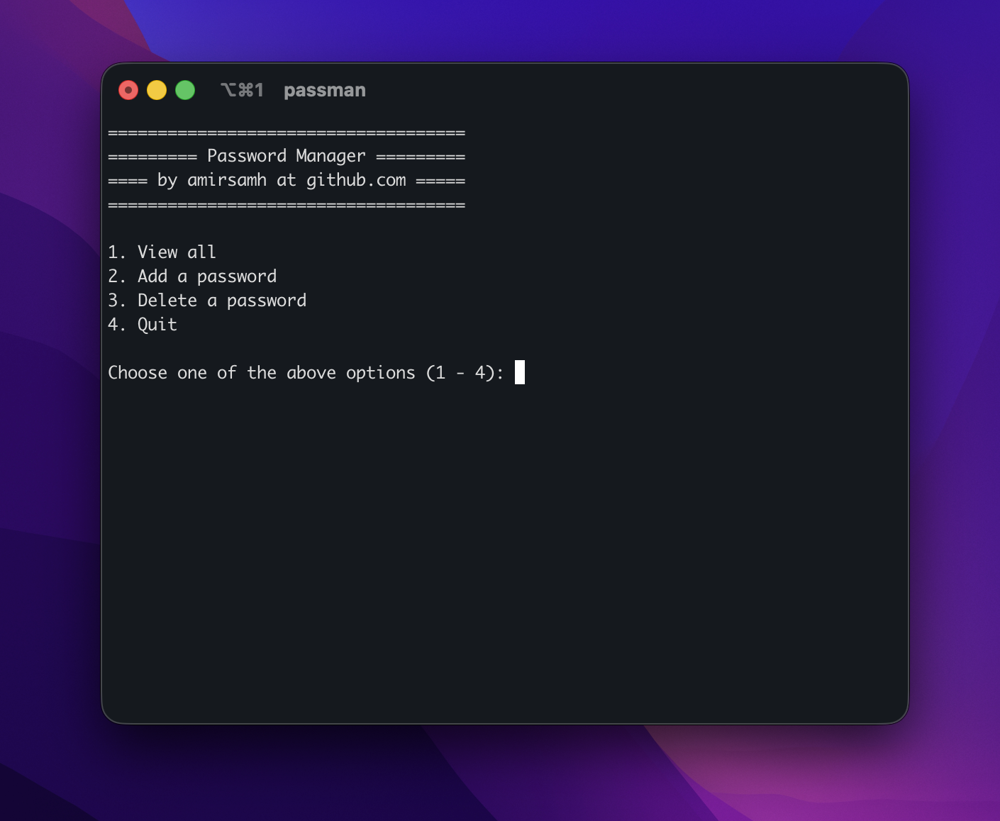
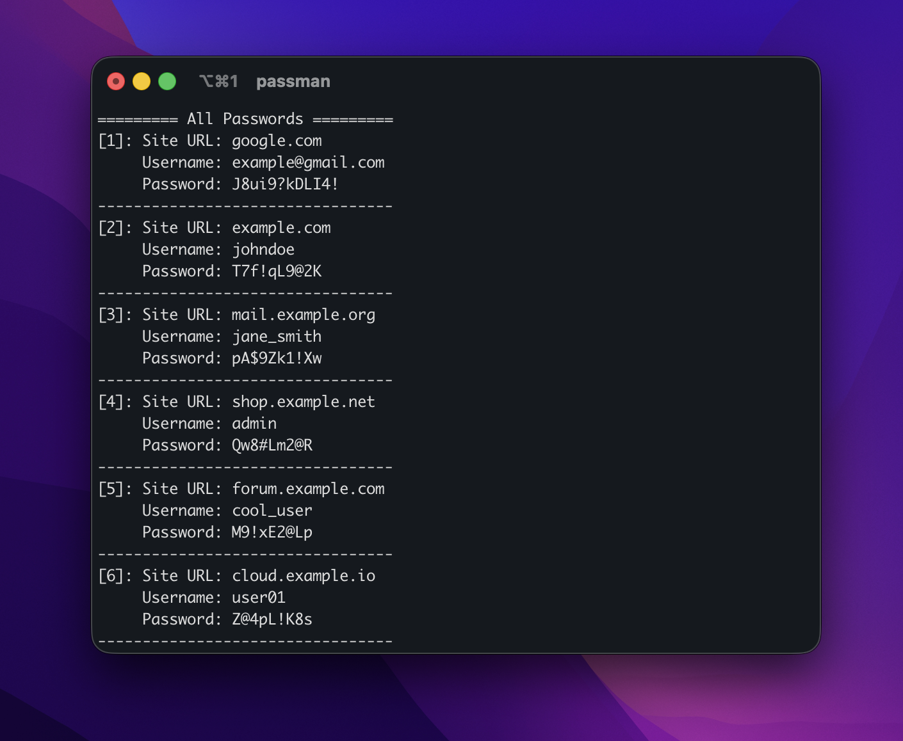
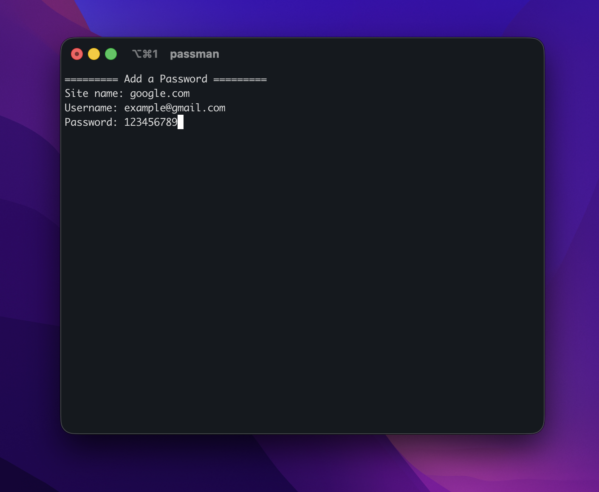
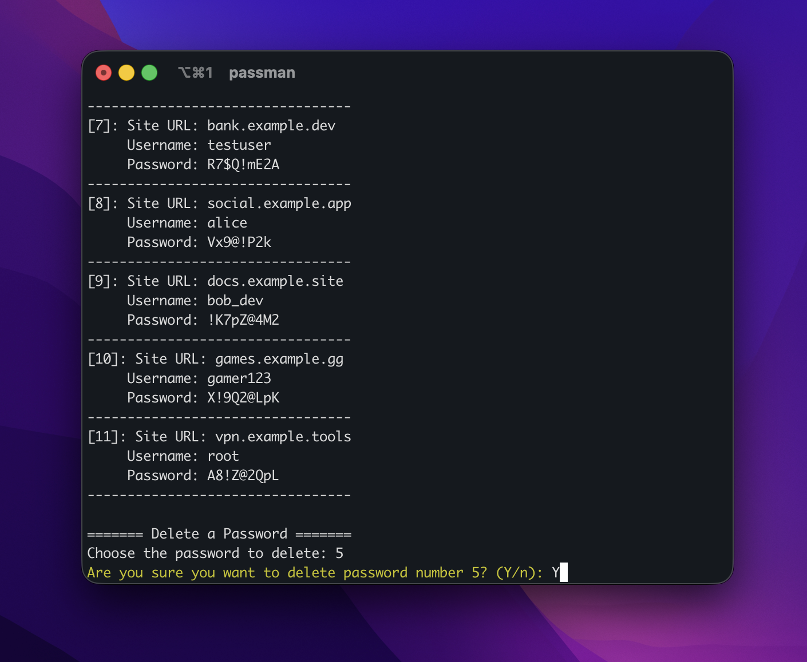

# CLI Password Manager

A simple and lightweight **command-line password manager** written in **C++**.  
It allows users to **add, view, and delete passwords** directly from the terminal.

## Features

- Add new passwords
- View stored passwords
- Delete existing passwords
- Fast and minimal CLI interface
- Passwords are stored in a local .txt file
- Built with modern C++ (C++ 17+)

## Requirements

- C++ compiler with C++17 support or newer
  - GCC 9+
  - Clang 10+
  - MSVC 2019+
- (Optional) CMake 3.15+

## Installation

### Build with CMake

```bash
git clone https://github.com/amirsamh/passman.git
cd passman
mkdir build && cd build
cmake ..
cmake --build .
```

Or compile with any other C++ compiler.

## Project structure
```text
passman/
├── main.cpp
├── manager.cpp
├── manager.h
└── data.txt
```

## Screenshots
### Main menu


### View all


### Add a new password


## Delete a password
